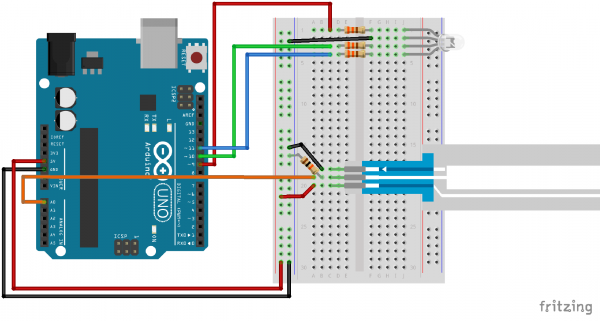

#Soft Potentiometer Tutorial
## SparkFun Tutorial Link
Here is the SparkFun tutorial [link](https://learn.sparkfun.com/tutorials/sik-experiment-guide-for-arduino---v32/experiment-10-reading-a-soft-potentiometer

## Sketch
Credit: SparkFun 
**!!!Important!!!** Connect the A0 on the sketch to A2 

## Description
This sample code read the value from the potentiometer and use the value to adjust the on-board LED's blink interval in ms.

Connect one of the outer pin to + on LilyPad
Connect the other outer pin to -
Connect the middle pin to A2.
